# DOSSIER DE RENDU — INFRASTRUCTURE

**Projet : Lency — SaaS, plateforme communautaire dans l'audiovisuel**
**Équipe : Timothée Van Den Bosch - Guerric Cochelin**

| Domaine | URL |
|---|---|
| Production | https://lency.net |
| Staging | https://staging.lency.net |

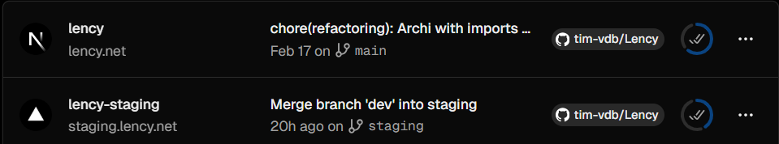

---

## 1. Application déployée et fonctionnelle

### Accessibilité

L'application est accessible en production sur **https://lency.net** et disponible en pré-production sur **https://staging.lency.net**.

Le déploiement est effectué via **Vercel** (PaaS), connecté au dépôt GitHub `tim-vdb/Lency` :

- Branche `main` → déployée automatiquement sur `lency.net` (production)
- Branche `staging` → déployée automatiquement sur `staging.lency.net` (staging)


### Base de données

La base de données est un **PostgreSQL serverless** hébergé sur **Neon.com**, connectée via **Prisma ORM**. Elle est opérationnelle sur les deux environnements avec des instances séparées (production / staging).

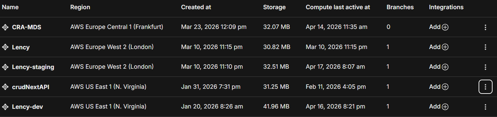

### Projet récupéré depuis GitHub

Le projet est lié au dépôt privé `github.com/tim-vdb/Lency`.

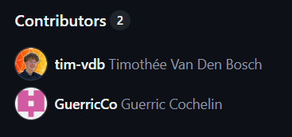

Chaque push sur une branche surveillée déclenche automatiquement un nouveau build et déploiement sur Vercel.

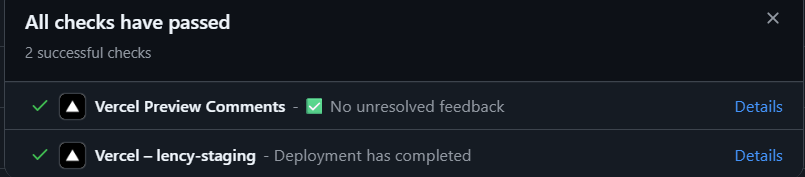

### Front correctement servi

Le frontend est structuré avec **Next.js 15 (App Router)** compilée via **Turbopack**. Vercel sert les assets statiques depuis son CDN et les 33 routes dynamiques sont exposées via des **fonctions serverless Node.js 24.x**

---

## 2. Qualité de l'hébergement / architecture

### Choix d'hébergement : PaaS — Vercel

Vercel a été retenu comme hébergeur **PaaS** pour sa compatibilité native avec Next.js, sa gestion automatique du scaling, du CDN et du SSL, et sa simplicité d'intégration CI/CD avec GitHub.

### Architecture multi-environnements

```
GitHub (tim-vdb/Lency)
├── branch main     →  Vercel → lency.net          (Production)
└── branch staging  →  Vercel → staging.lency.net  (Staging)
```

Chaque environnement dispose de :
- Son propre projet Vercel (`lency` / `lency-staging`)
- Sa propre base de données Neon.com
- Ses propres variables d'environnement injectées via **Doppler**

### Architecture claire

- **Frontend** : Next.js 15, App Router, Turbopack
- **Backend** : API Routes Next.js → Fonctions serverless Node.js 24.x
- **Base de données** : Neon.com (PostgreSQL serverless) + Prisma ORM
- **Gestion des secrets** : Doppler (projets isolés prod / staging / development)
- **Emails** : Resend (transactionnel via `support@mail.lency.net`) + Proton Mail SMTP (`social@lency.net`)
- **Sous-domaines** :
  - `lency.net` — production
  - `staging.lency.net` — pré-production
  - `mail.lency.net` — envoi d'emails (SPF / DKIM / DMARC configurés dans Vercel / Resend) 

---

## 3. Sécurité et bonnes pratiques

### HTTPS

HTTPS activé automatiquement sur tous les domaines via les certificats SSL gérés par Vercel (Let's Encrypt). Aucune connexion HTTP non chiffrée n'est possible.

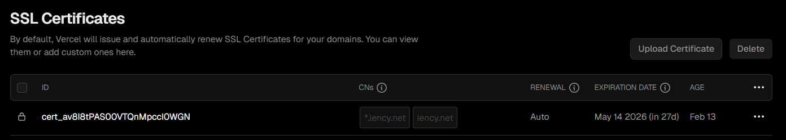

### Secrets non exposés

Les variables d'environnement (clés API, chaînes de connexion DB, secrets d'auth) sont **exclusivement gérées via Doppler**. Elles ne sont jamais commitées dans le dépôt GitHub (`.env.local` présent dans `.gitignore`). Doppler injecte les secrets au moment du build Vercel selon l'environnement (production ou staging et en local development lors du développement).

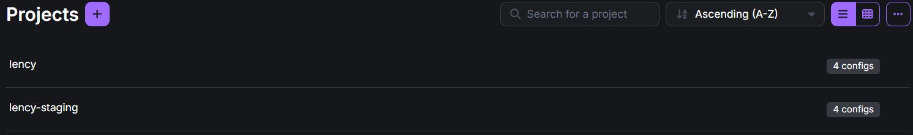

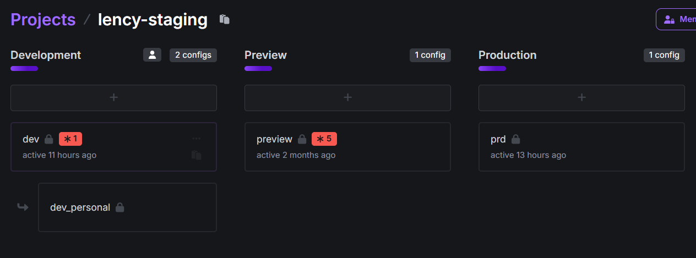

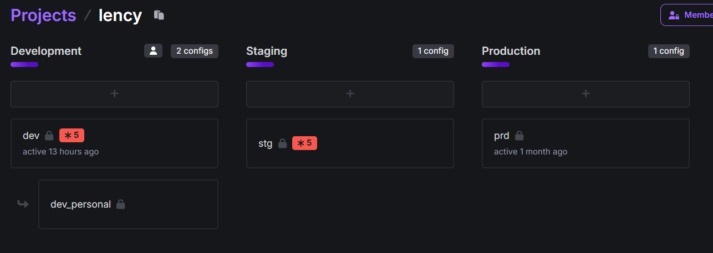

### Debug désactivé en production

Le mode debug Next.js est désactivé en production. Les logs d'erreur sont disponibles uniquement via le dashboard Vercel (runtime logs) et non exposés publiquement.

### Accès sécurisé

L'authentification est gérée via **Better Auth** (`/api/auth/[...all]`), avec sessions sécurisées. L'accès au dashboard Vercel est protégé par compte Vercel (2FA disponible). Aucun accès SSH nécessaire (architecture PaaS — pas de serveur à gérer) mais la CLI de Vercel est activé sur le projet en local.

---

## 4. Exploitabilité / maintenance

### Mise à jour depuis GitHub

Tout déploiement est déclenché automatiquement par un push GitHub sur la branche correspondante. Aucune intervention manuelle requise pour déployer.

### Logs et supervision

- **Build logs** : disponibles dans le dashboard Vercel pour chaque déploiement

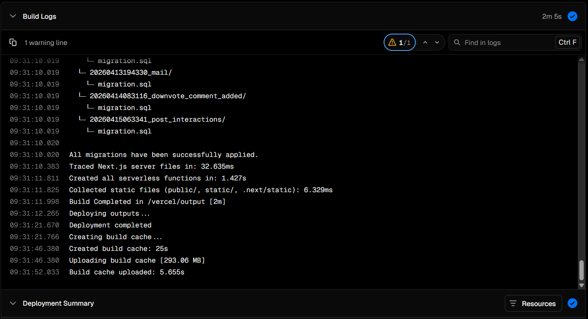

- **Runtime logs** : fonctions serverless loguées en temps réel sur Vercel (filtrage par niveau, source, status code)

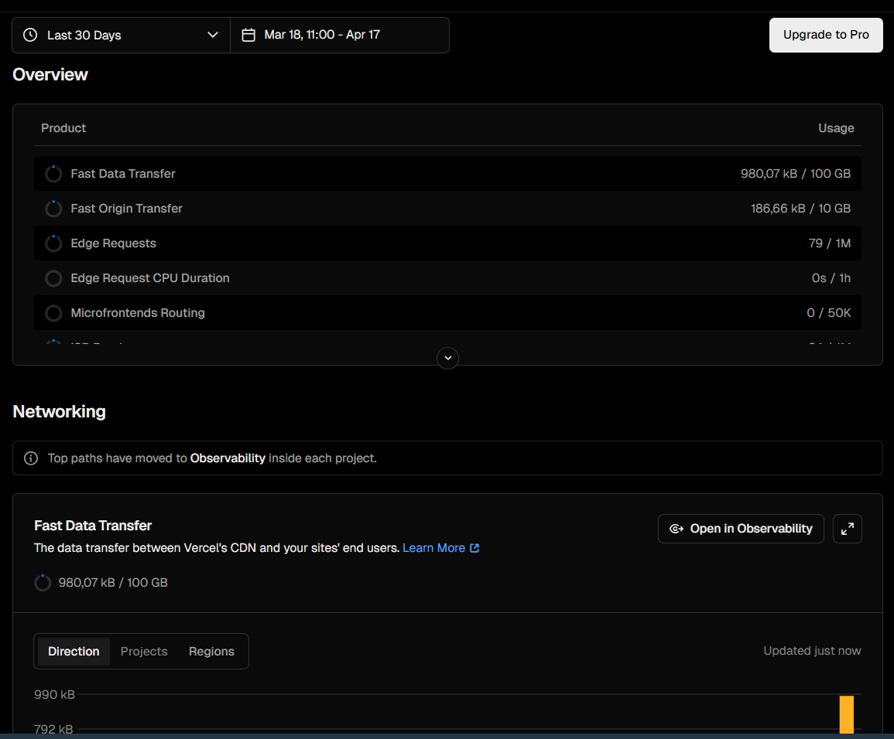

- **Base de données** : supervision via le dashboard Neon.com (connexions, queries, métriques)

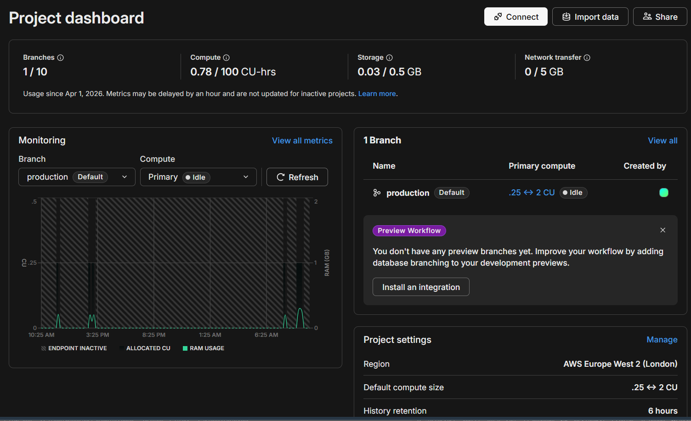

### Maintenance

La maintenance est géré directement via une variable d'environnement stocké sur **Doppler** et vérifie si elle est à true pour afficher la page /maintenance sur [lency.net](https://lency.net) en production ou sur la pré-production [staging.lency.net](https://staging.lency.net)

### Procédure d'accès serveur

Architecture PaaS — pas de serveur à administrer directement. L'accès se fait via :
1. Dashboard Vercel pour gérer l'hébergement, nom de domaine, SSL, Analytics etc.
2. Dashboard Neon.com pour la base de données
3. Dashboard Doppler pour les secrets d'environnements
4. CLI Vercel pour les opérations avancées directement depuis l'IDE

---

## 5. Dossier de rendu

### Solution retenue

La solution retenue repose sur une architecture **PaaS entièrement managée**, sans serveur à administrer :

- **Vercel** comme plateforme d'hébergement et de déploiement continu pour l'application **Next.js 15**
- **Neon.com** pour la base de données **PostgreSQL serverless**, avec deux instances isolées (production / staging)
- **Prisma ORM** pour la gestion du schéma de données et les migrations versionées
- **Doppler** pour la gestion centralisée des secrets d'environnement (3 projets : `lency`, `lency-staging`, `lency-development`)
- **Resend** pour l'envoi d'emails transactionnels depuis `support@mail.lency.net`
- **Better Auth** pour l'authentification avec sessions sécurisées

Le déploiement est entièrement automatisé via un pipeline CI/CD GitHub géré par Vercel vers le déploiement hébergé sur Vercel : chaque push sur `main` ou `staging` déclenche un build, une migration Prisma et un déploiement sans intervention manuelle.

---

### Étapes de déploiement

1. **Connexion GitHub → Vercel** : lier le dépôt privé `tim-vdb/Lency` aux deux projets Vercel (`lency` et `lency-staging`)
2. **Configuration des branches** : `main` → `lency.net` (production), `staging` → `staging.lency.net`
3. **Création des bases de données** sur Neon.com (instances prod et staging séparées), récupération des `DATABASE_URL`
4. **Configuration Doppler** : création des trois projets avec toutes les variables d'environnement (DB, auth, API keys, SMTP...)
5. **Intégration Doppler ↔ Vercel** : activation de la synchronisation automatique des secrets au moment du build via le dashboard Doppler
6. **Configuration du domaine** `lency.net` sur Vercel, ajout des enregistrements DNS chez Vercel
7. **Ajout des sous-domaines** : `staging.lency.net` et `mail.lency.net` (pour Resend)
8. **Configuration email** : ajout des enregistrements SPF, DKIM et DMARC dans les DNS pour `mail.lency.net` via Resend
9. **Vérification SSL** : certificats Let's Encrypt provisionnés automatiquement par Vercel sur tous les domaines

---

### Difficultés rencontrées

- **Adapter Prisma pour Neon serverless** : Neon fonctionne via WebSocket en mode serverless, ce qui nécessite `@neondatabase/serverless` et `@prisma/adapter-neon` à la place du driver PostgreSQL classique. La configuration de l'adaptateur dans le client Prisma a demandé des ajustements spécifiques.

- **Migrations Prisma en production** : l'exécution des migrations au moment du build Vercel (et non au runtime) a imposé la création d'un script `vercel-build` dédié, pour garantir que le schéma DB est toujours synchronisé avec le code déployé.

- **Injection des secrets via Doppler** : la configuration de la synchronisation Doppler → Vercel nécessite une intégration spécifique côté Doppler. Comprendre la priorité entre les variables définies directement dans Vercel et celles injectées par Doppler a nécessité des tests.

- **Configuration DNS et emails** : la mise en place des enregistrements SPF, DKIM et DMARC pour `mail.lency.net` a requis une configuration précise côté Vercel et Resend pour éviter que les emails atterrissent en spam.

- **Gestion des conflits de merge** : le workflow multi-branches (`main` / `staging` / `dev` / features) a occasionné des problématiques à réfléchir.

---

### Justification des choix

| Choix | Justification |
|---|---|
| **Vercel (PaaS)** | Compatibilité native avec Next.js (même éditeur), CDN global intégré, scaling automatique, SSL automatique, 0 gestion de serveur, intégration CI/CD GitHub en quelques clics géré via Vercel |
| **Neon.com (PostgreSQL serverless)** | Serverless adapté aux charges variables d'un SaaS, pricing à l'usage, instances isolées par environnement, compatibilité totale avec Prisma via adaptateur officiel |
| **Prisma ORM** | Type-safety complète avec TypeScript, migrations versionées et traçables dans Git, Prisma Studio pour visualiser la DB en développement |
| **Doppler** | Centralisation des secrets multi-environnements en un seul outil, intégration native Vercel, aucun secret dans le code ni dans `.env` commité |
| **Better Auth** | Bibliothèque d'authentification moderne et flexible pour Next.js App Router, sessions sécurisées, extensible (OAuth, 2FA...) |
| **Resend** | Envoi d'emails transactionnels fiable via API REST simple, support SPF/DKIM/DMARC natif, taux de délivrabilité élevé |
