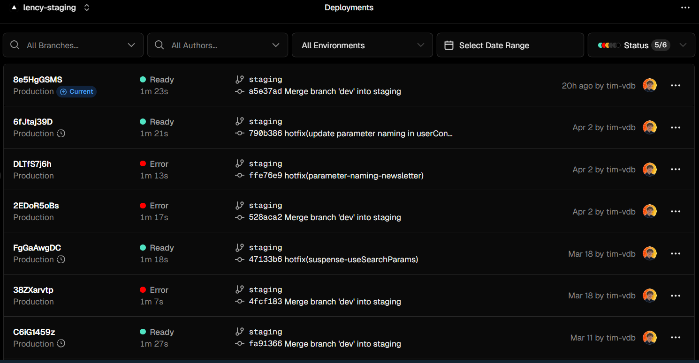

# DOSSIER DE RENDU — INFRASTRUCTURE

**Projet : Lency — SaaS, plateforme communautaire dans l'audiovisuel**
**Équipe : Timothée Van Den Bosch - Guerric Cochelin**

| Domaine | URL |
|---|---|
| Production | https://lency.net |
| Staging | https://staging.lency.net |

---

## 1. Application déployée et fonctionnelle

### Accessibilité

L'application sera accessible en production sur **https://lency.net** et est déjà disponible en pré-production sur **https://staging.lency.net**.

Le déploiement est effectué via **Vercel** (PaaS), connecté au dépôt GitHub `tim-vdb/Lency` :

- Branche `main` → déployée automatiquement sur `lency.net` (production)
- Branche `staging` → déployée automatiquement sur `staging.lency.net` (staging)



### Base de données

La base de données est un **PostgreSQL serverless** hébergé sur **Neon.com**, connectée via **Prisma ORM**. Elle est opérationnelle sur les deux environnements avec des instances séparées (production / staging).

### Projet récupéré depuis GitHub

Le projet est lié au dépôt privé `github.com/tim-vdb/Lency`. Chaque push sur une branche surveillée par déclenche automatiquement un nouveau build et déploiement sur Vercel.

### Front correctement servi

Le frontend est une application **Next.js 15 (App Router)** compilée via **Turbopack**. Vercel sert les assets statiques depuis son CDN et les 33 routes dynamiques sont exposées via des **fonctions serverless Node.js 24.x** :

| Domaine fonctionnel | Routes serverless |
|---|---|
| Auth | `/api/auth/[...all]` |
| Articles | `/api/articles`, `/api/articles/[articleId]` |
| Badges | `/api/badges`, `/api/badges/[badgeId]` |
| Categories | `/api/categories`, `/api/categories/[categoryId]` |
| Emails | `/api/emails/welcome` |
| Events | `/api/events`, `/api/events/[eventId]` |
| MapLocations | `/api/mapLocations`, `/api/mapLocations/[mapLocationId]` |
| Newsletter | `/api/newsletterSubscribers`, `/api/newsletterSubscribers/[newsletterSubscriberId]` |
| Posts & Comments | `/api/posts`, `/api/posts/[postId]`, `/api/posts/[postId]/comments`, `/api/posts/[postId]/comments/[commentId]` |
| Projects | `/api/projects`, `/api/projects/[projectId]` |
| Resources | `/api/resources`, `/api/resources/[resourceId]` |
| Spots | `/api/spots`, `/api/spots/[spotId]` |
| Subscriptions | `/api/subscriptions`, `/api/subscriptions/[subscriptionId]` |
| Upload | `/api/uploadthing` |
| UserConfig | `/api/userConfig`, `/api/userConfig/[userConfigId]` |
| Users | `/api/users`, `/api/users/[userId]`, `/api/users/change-password`, `/api/users/confirm-email-change`, `/api/users/verify-email-change` |

---

## 2. Qualité de l'hébergement / architecture

### Choix d'hébergement : PaaS — Vercel

Vercel a été retenu comme hébergeur **PaaS** pour sa compatibilité native avec Next.js, sa gestion automatique du scaling, du CDN et du SSL, et sa simplicité d'intégration CI/CD avec GitHub.

### Architecture multi-environnements

```
GitHub (tim-vdb/Lency)
├── branch main     →  Vercel → lency.net          (Production)
└── branch staging  →  Vercel → staging.lency.net  (Staging)
```

Chaque environnement dispose de :
- Son propre projet Vercel (`lency` / `lency-staging`)
- Sa propre base de données Neon.com
- Ses propres variables d'environnement injectées via **Doppler**

### Architecture claire

- **Frontend** : Next.js 15, App Router, Turbopack
- **Backend** : API Routes Next.js → Fonctions serverless Node.js 24.x
- **Base de données** : Neon.com (PostgreSQL serverless) + Prisma ORM
- **Gestion des secrets** : Doppler (projets isolés prod / staging / development)
- **Emails** : Resend (transactionnel via `support@mail.lency.net`) + Proton Mail SMTP (`social@lency.net`)
- **Sous-domaines** :
  - `lency.net` — production
  - `staging.lency.net` — pré-production
  - `mail.lency.net` — envoi d'emails (SPF / DKIM / DMARC configurés dans Vercel / Resend) 

---

## 3. Sécurité et bonnes pratiques

### HTTPS

HTTPS activé automatiquement sur tous les domaines via les certificats SSL gérés par Vercel (Let's Encrypt). Aucune connexion HTTP non chiffrée n'est possible.

### Secrets non exposés

Les variables d'environnement (clés API, chaînes de connexion DB, secrets d'auth) sont **exclusivement gérées via Doppler**. Elles ne sont jamais commitées dans le dépôt GitHub (`.env.local` présent dans `.gitignore`). Doppler injecte les secrets au moment du build Vercel selon l'environnement (production ou staging et en local development lors du développement).

### Debug désactivé en production

Le mode debug Next.js est désactivé en production. Les logs d'erreur sont disponibles uniquement via le dashboard Vercel (runtime logs) et non exposés publiquement.

### Accès sécurisé

L'authentification est gérée via **Better Auth** (`/api/auth/[...all]`), avec sessions sécurisées. L'accès au dashboard Vercel est protégé par compte Vercel (2FA disponible). Aucun accès SSH nécessaire (architecture PaaS — pas de serveur à gérer) mais la CLI de Vercel est activé sur le projet en local.

---

## 4. Exploitabilité / maintenance

### Mise à jour depuis GitHub

Tout déploiement est déclenché automatiquement par un push GitHub sur la branche correspondante. Aucune intervention manuelle requise pour déployer.

### Logs et supervision

- **Build logs** : disponibles dans le dashboard Vercel pour chaque déploiement
- **Runtime logs** : fonctions serverless loguées en temps réel sur Vercel (filtrage par niveau, source, status code)
- **Base de données** : supervision via le dashboard Neon.com (connexions, queries, métriques)

### Procédure d'accès serveur

Architecture PaaS — pas de serveur à administrer directement. L'accès se fait via :
1. Dashboard Vercel pour gérer l'hébergement, nom de domaine, SSL, Analytics etc.
2. Dashboard Neon.com pour la base de données
3. Dashboard Doppler pour les secrets d'environnements
4. CLI Vercel pour les opérations avancées

---

## 5. Dossier de rendu (/2 pts)

### Solution retenue

_(à compléter)_

### Étapes de déploiement

_(à compléter)_

### Difficultés rencontrées

_(à compléter)_

### Justification des choix

_(à compléter)_
